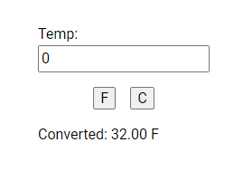

# Temperature Converter

**May 15, 2024 Wednesday**
- To practice html-css-js, today I will build a simple page that takes user input to convert temperature to fahrenheit or celcius

**Sample Output**

